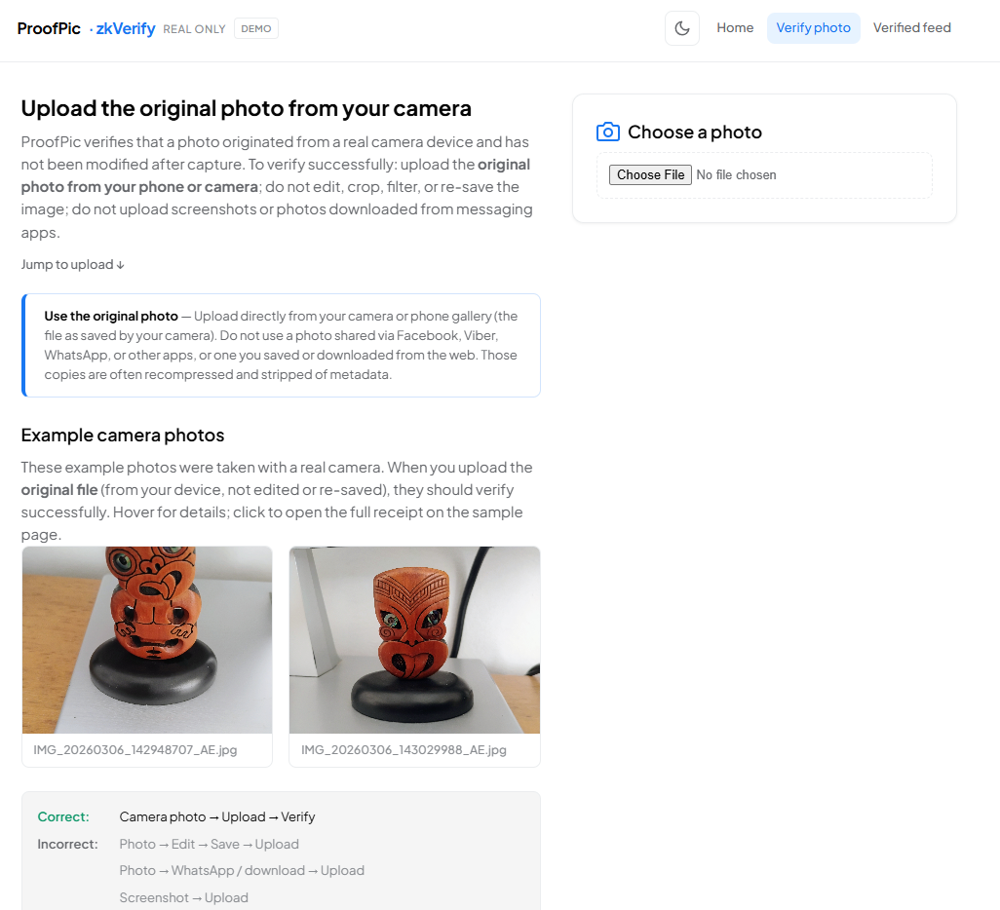

# ProofPic — Verify Your Photos Are Real

A proof-of-concept web app: upload a photo and get a **Verified Real Photo** badge backed by a zero-knowledge proof that the image **originated from genuine camera hardware and has not been modified after capture**. Verification is designed to run on [zkVerify](https://zkverify.io).

## Run the demo

```bash
cd ProofPic
npm install
npm run dev
```

Open **http://localhost:5173**. Use **Verify photo** to upload an image; the app simulates: metadata checks → image hash → device attestation → ZK proof → zkVerify submission → badge.

**Important:** For verification to be valid, the user must upload the **original photo** from the camera or phone (the file as saved by the device). Photos that were shared via Facebook, Viber, WhatsApp, etc., or saved/downloaded from the web are often recompressed and stripped of metadata, so they cannot be fully verified.

## What this PoC does

- **Home:** Pitch, “use the original photo” requirement, how it works, what you get, use cases, and a **For reviewers** collapsible checklist.
- **Verify photo:** Upload (original from camera/phone only), **example camera photos** (hover for details, click to open full receipt at `/v/demo`), instruction graphic, **Verification pipeline**, and **For reviewers** notes. On success, you can open a **public receipt page**. Re-save detection: we reject if the file was saved more than a few seconds after EXIF capture (e.g. after editing in Paint).
- **Verified feed:** List of photos that passed verification (stored in `localStorage`). Each card links to a public receipt.
- **Sample receipt:** `/v/demo` shows a sample verification receipt for reviewers.
- **Collections:** Home encourages verifying multiple photos (dating profile, marketplace listing, portfolio, social media, and more) to drive repeat proofs.

All crypto and zkVerify are **simulated** in the browser. Production would use:

- Real image hashing (e.g. SHA-256 or content hash).
- Device attestation (Android Play Integrity, iOS App Attest, or WebAuthn).
- A Groth16 circuit (e.g. Circom + snarkjs) and [zkVerifyJS](https://docs.zkverify.io/overview/zkverifyjs) for proof submission.

## Project layout

- `src/pages/Home.jsx` — Landing, what you get, use cases, For reviewers.
- `src/pages/VerifyPhoto.jsx` — Upload, step progress, badge result, What we verify / Privacy / For reviewers.
- `src/pages/VerifiedPictures.jsx` — Verified feed with public receipt links.
- `src/pages/VerificationReceipt.jsx` — Public receipt page (`/v/:receiptId`, plus `/v/demo` sample).
- `src/store/verifiedPhotos.js` — Persist verified entries and thumbnails (localStorage).
- `src/mock/verification.js` — Simulated hash, attestation, proof, and zkVerify.
- `src/components/ZkVerifyTooltip.jsx` — Inline tooltip explaining zkVerify and link to zkverify.io.
- `scripts/check-exif.cjs` — Debug script to run the demo EXIF checks on a local file.
- `vercel.json` — SPA routing so `/verify`, `/v/demo`, etc. work on refresh when deployed to Vercel.
- `IDEA-ProofPic.md` — Proposal and program-fit notes for Thrive zkVerify Web2.

## Sharing (Open Graph)

`index.html` includes Open Graph and Twitter Card meta tags. The share image is `public/og-image.svg` (1200×630, ProofPic branding). Some platforms (e.g. Facebook, LinkedIn) prefer PNG/JPEG; for maximum compatibility you can add `public/og-image.png` at 1200×630 and point `og:image` / `twitter:image` to it.

## Simulated proof flow (demo)

In this demo we do **not** call zkVerify or generate real Groth16 proofs. We simulate the pipeline:

1. **Upload** — User selects a photo (JPEG from camera preferred).
2. **EXIF / authenticity checks** — We reject if: no EXIF; Software tag indicates an editor (Paint, Adobe, etc.); no Make/Model; PNG or screenshot-like filename; or file save time is more than a few seconds after EXIF capture time (re-save heuristic). See `src/mock/verification.js` and `scripts/check-exif.cjs`.
3. **Simulated steps** — Hash → device attestation → ZK proof → zkVerify submission are simulated; the UI shows step progress and produces a **receipt-shaped result** (proof ID, tx hash, device, capture time, etc.) that matches the format we will use in production.
4. **Receipt and feed** — User gets a “Verified Real Photo” badge and a shareable receipt URL (`/v/:receiptId`). Sample receipt for reviewers: `/v/demo`.

## Path to production (Groth16 + zkVerify)

- **Real image hashing** — e.g. SHA-256 or content hash of the image.
- **Device attestation** — Android Play Integrity, iOS App Attest, or WebAuthn at capture time to bind the hash to genuine hardware.
- **Groth16 circuit** — Private inputs: attestation data; public inputs: image hash (or commitment). Proof statement (production): “the prover demonstrates knowledge of an image hash and a valid device attestation proving the image originated from genuine camera hardware.”
- **zkVerify** — Submit proof via zkVerifyJS or zkVerify API; receive on-chain receipt (proof ID, tx hash). Funded account (e.g. tVFY on Volta) for submission.
- **Backend** — Proof generation and submission run server-side; client uploads photo and triggers the flow.

## Deployment (Vercel)

The app is a single-page application (SPA). **Include `vercel.json`** in the project root so that routes like `/verify`, `/v/demo`, and `/verified` work on refresh (they must serve `index.html`). If `/verify` or `/v/demo` return 404 after deploy, ensure `vercel.json` is present and redeploy.

```json
{
  "rewrites": [
    { "source": "/(.*)", "destination": "/index.html" }
  ]
}
```

## Screenshots (for reviewers)

Reviewers can try the **live demo** ([home](https://proof-of-picwith-zk.vercel.app) | [verify](https://proof-of-picwith-zk.vercel.app/verify) | [sample receipt](https://proof-of-picwith-zk.vercel.app/v/demo)) to see the full flow.



## Design

UI and styling are adapted from the [ZK proof](../ZK%20proof) project. Card icons (camera, shield, chain) and flow strip on Home; light/dark theme toggle.
